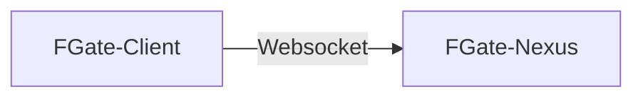

# Flow Gate

## 新一代Minecraft服务器管理解决方案

## 快速开始

### 架构介绍

Client端是安装在`Minecraft服务器侧`的，连接到**单独部署**的`Nexus管理端`，通过Nexus暴露的端口进行`正向WebSocket`通讯，内容遵循[JSONRPC-2.0协议](https://www.jsonrpc.org/specification)。

### 部署

请前往下一页阅读[部署文档](install/index.md)。
