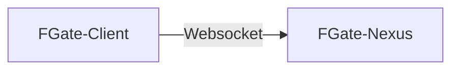

# Flow Gate

## 新一代Minecraft服务器管理解决方案

## 快速开始

### 架构介绍

Client端是安装在`Minecraft服务器侧`的，连接到**单独部署**的`Nexus管理端`，通过Nexus暴露的端口进行`正向WebSocket`通讯，内容遵循[JSONRPC-2.0协议](https://www.jsonrpc.org/specification)。

### 特性

#### [Flow Gate Nexus](https://github.com/CrashVibe/FGATE-Nexus/)

一个基于 Nuxt 3 的全栈应用，专为Minecraft服务器集群管理设计，内置Onebot适配器实现，支持打包为独立二进制文件，实现"打开即用"的分发体验。

- 🚀 **独立可执行文件** - 基于 Bun 打包，无需安装 Node.js
- 🎮 **游戏服务器管理** - 支持 Minecraft 等游戏服务器的监控和管理
- 🤖 **OneBot 适配器** - 集成聊天机器人适配器，支持多平台消息处理
- 🌍 **跨平台支持** - Linux, macOS, Windows
- ⚡ **完整功能** - WebSocket 实时通信, SQLite 数据库, RESTful API
- 🎨 **现代 UI** - 基于 Naive UI 的响应式界面
- 📦 **一键分发** - 完整的构建和分发脚本

#### [Flow Gate Client](https://github.com/CrashVibe/FGATE-Client)

Minecraft服务器侧的FlowGate客户端，基于Java开发，与Nexus开放的WebSocket接口进行通信。

### 部署

请前往下一页阅读[部署文档](install/index.md)。
